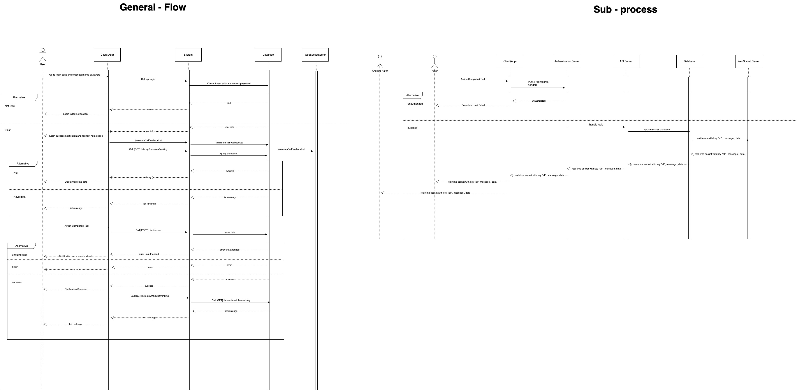

# **Scoreboard API Specification**

## **Introduction**

- This API module is designed to update the leaderboard in real-time when a user completes an action. 
- The system tracks user scores and ensures that only authorized actions can modify a user's score. 
- It provides a backend endpoint to update the score and retrieve the top scores.

### **Functional Requirements:**
- The system will track the top 10 users' scores.
- Once a user completes an action, their score is updated in the database.
- Real-time updates should be reflected in the leaderboard.
- Only authenticated and authorized users should be allowed to update their scores.
- Each action corresponds to a predefined score based on an **Action Enum**.

---

## **Action Enum**  

The actions that users perform are defined in an enumeration, with each action having a specific point value associated with it.

### **Action Enum Structure**:

```json
{
  "actions": {
    "TASK_COMPLETED": 100,       // Completing a task gives 100 points
    "VIEW_ADS": 50,              // View ads gives 50 points
    "LEVEL_UP": 200,             // Level up gives 200 points
    "REFERRAL": 150              // Referring a friend gives 150 points
  }
}

1. Collection users
This collection stores the user's information, including the totalPoints field to store the user's total points.

{
  "_id": ObjectId("..."),
  "user_id": "user_id_john",       
  "username": "john",          
  "email": "john@example.com",
  "totalPoints": 500,                
  "created_at": "2025-02-18T08:00:00Z",  
  "updated_at": "2025-02-18T08:00:00Z"  
}


2. Collection scores
- This collection saves user score records every time they perform an action. 
- Each record will contain information about scores, actions, and time updates.

{
  "_id": ObjectId("..."),
  "user_id": "user_id_john",
  "points": 100,
  "action_id": "TASK_COMPLETED",
  "task_id": "task_id",
  "created_at": "2025-02-18T08:00:00Z",
  "updated_at": "2025-02-18T08:00:00Z" 
}

3. Collection tasks
- This collection stores the user's note-taking tasks.

{
  "_id": ObjectId("..."),
  "name": "View product 1",
  "status": "COMPLETED",           
  "created_at": "2025-02-18T08:00:00Z",
  "updated_at": "2025-02-18T08:00:00Z"
}

### **API Endpoints**

1. Get rankings of top 10 users
URL: /api/users/rankings

Method: GET

headers: {
    'Authorization':"Bearer {token}"
}


Description: This api return the 10 user have max point.

Response:
[
  {
    "user_id": "user_id_value",
    "username": "user_name",
    "email":"user_name@gmail.com",
    "points": 500,
    "updated_at": "2025-02-18T08:00:00Z"
  },
  {
    "user_id": "user_id_value_2",
    "username": "user_name_2",
    "email":"user_name_2@gmail.com",
    "points": 450,
    "updated_at": "2025-02-18T08:00:00Z"
  },
  {
    "user_id": "user_id_value_3",
    "username": "user_name_3",
    "email":"user_name_3@gmail.com",
    "points": 250,
    "updated_at": "2025-02-18T08:00:00Z"
  },
  {
    "user_id": "user_id_value_4",
    "username": "user_name_4",
    "email":"user_name_4@gmail.com",
    "points": 220,
    "updated_at": "2025-02-18T08:00:00Z"
  },
  {
    "user_id": "user_id_value_5",
    "username": "user_name_5",
    "email":"user_name_5@gmail.com",
    "points": 50,
    "updated_at": "2025-02-18T08:00:00Z"
  }

]


2. Save scores of user
## POST /api/scores

**Description:** Save scores of user and update total points.

**Require:**

*   **URL:** `/api/scores`
*   **Method:** `POST`
*   **Headers:**
    *   `Authorization: Bearer {token}` (JWT token)
*   **Body:**

```json
{
  "user_id": "user_id_john",
  "action_id": "TASK_COMPLETED", (enum: ["TASK_COMPLETED", "VIEW_ADS", "LEVEL_UP", "REFERRAL"]),
  "task_id": "task_1",
  "timestamp": "2024-08-03T10:00:00Z"
}

Response:
+ Case success:

{
  "message": "Save scores successfully",
  "data": {
    "_id": ObjectId("..."),
    "user_id": "user_id_john",
    "points": 100,
    "action_id": "TASK_COMPLETED",
    "task_id": "task_1",
    "created_at": "2025-02-18T08:00:00Z",
    "updated_at": "2025-02-18T08:00:00Z"
  },
  "status": 201
}


+ Valid users have taken action in the last 24 hours:

{
  "message": "You can't perform this action again yet.",
  "status": 400,
  "error_code": "DUPLICATE_ACTION",
  "details": "User has already performed this action within the last 24 hours."
}

+ Error (401 Unauthorized):

{
  "message": "Unauthorized",
  "status": 401,
  "error_code": "INVALID_TOKEN"
}


## **Create a diagram to illustrate the flow of execution. **  
[Link to diagram]: https://app.diagrams.net/#G1vle8M3IJY6PGCs0bY8nOAhQgBk6a_CD5#%7B%22pageId%22%3A%22kHhtjelfMX16ehmt1snR%22%7D




## ** Security & Real-Time Updates ** 
- Authentication: API requests are authenticated using JWT (JSON Web Tokens). The token must be passed in the Authorization header as Bearer {token}.
- Real-Time Updates: Real-time leaderboard updates can be implemented using WebSockets or Server-Sent Events (SSE) to push updates to the client as scores are updated.


## ** HTTP Status Codes: ** 
200 OK: Success.
201 Created.
400 Bad request.
401 Unauthorized: Invalid or missing token.
500 Internal Server Error: Server error during the request.